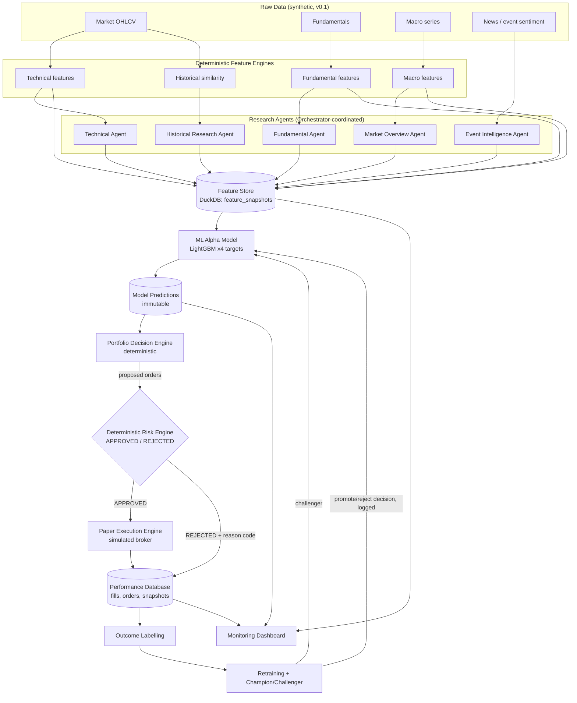
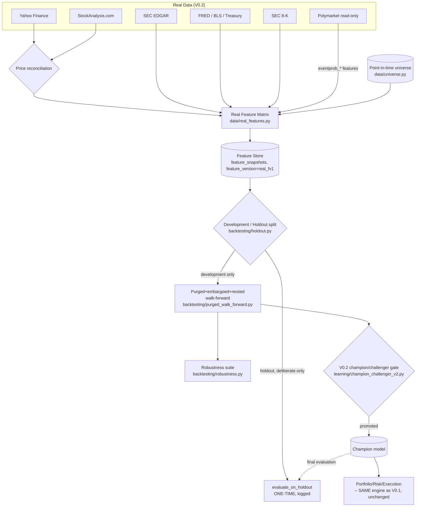

# Architecture (Version 0.1, + Version 0.2 addendum below)

market-agent-lab is a **paper-trading / simulation-only** multi-agent
quantitative research system. This document describes the fifteen core
components, how data flows between them, and the hard safety boundaries
that hold at every layer.

## Component map

| # | Component | Module |
|---|-----------|--------|
| 1 | Orchestrator Agent | `agents/orchestrator.py` |
| 2 | Technical Analysis Agent | `agents/technical.py` |
| 3 | Fundamental Analysis Agent | `agents/fundamental.py` |
| 4 | Market Overview Agent | `agents/market_overview.py` |
| 5 | Historical Research Agent | `agents/historical.py` |
| 6 | News / Event Intelligence Agent | `agents/event_intelligence.py` |
| 7 | Feature Store | `features/feature_store.py` |
| 8 | ML Alpha Model | `models/train.py`, `models/predict.py` |
| 9 | Portfolio Decision Engine | `portfolio/allocation.py` |
| 10 | Deterministic Risk Engine | `portfolio/risk.py` |
| 11 | Paper Execution Engine | `execution/paper.py` |
| 12 | Performance Database | `database/` (DuckDB) |
| 13 | Model Training / Retraining Engine | `models/`, `learning/retrain.py` |
| 14 | Backtesting Engine | `backtesting/` |
| 15 | Monitoring Dashboard | `dashboard/app.py`, `api/main.py` |

## Data flow

## Hard safety boundaries

These are architectural invariants, enforced by code structure, not just
convention:

* **Simulation only.** `execution/paper.py` is a fully in-process simulated
  broker. There is no HTTP client, SDK, or credential anywhere in the
  codebase that talks to a real brokerage, exchange, or bank.
* **No prediction markets / betting.** `agents/event_intelligence.py`
  processes ordinary financial/economic news and scheduled corporate
  events only; no such data source is integrated anywhere.
* **Agents never place orders.** Every agent module (`agents/*.py`)
  returns a Pydantic `AgentReport` (or an agent-specific structured
  output) -- none of them import `execution/` or `portfolio/risk.py`.
  Order construction lives entirely in `portfolio/allocation.py`.
* **The Risk Engine is the only gate to execution.** `execution/orders.py`
  routes every proposed order through
  `portfolio.risk.RiskEngine.evaluate_order` before
  `execution/paper.py` will fill anything. There is no code path from a
  model prediction or an agent output directly into a fill.
* **The Risk Engine is deterministic.** `portfolio/risk.py` contains only
  arithmetic and comparisons against configured `RiskLimits` -- no LLM
  call, no learned model, no randomness.
* **Kill switch is explicit and sticky.** Once
  `RiskEngine.engage_kill_switch()` fires (from a daily-loss or drawdown
  breach), every subsequent order is rejected with `KILL_SWITCH` until a
  human operator calls `reset_kill_switch()` -- no agent, model, or
  automated process can reset it.
* **Predictions and fills are immutable.** `ModelPrediction`, `Outcome`,
  and `PaperFill` (`core/schemas.py`) are frozen Pydantic models;
  `database/repository.py` raises if you try to insert a prediction or
  outcome whose ID already exists.
* **No uncontrolled self-modification.** `learning/retrain.py` only ever
  produces a new `CHALLENGER` model version. Promotion to `CHAMPION`
  happens exclusively via `learning/champion_challenger.py`'s
  multi-criteria gate, and every decision (promote or reject, with
  rationale) is written to `promotion_log`.
* **Everything is recorded.** Agent reports, feature snapshots, model
  versions, predictions, proposed orders (approved and rejected, with
  reason codes), fills, and portfolio snapshots are all persisted to
  DuckDB (see `database/schema.py`).

## Why DuckDB, and how to migrate to PostgreSQL/TimescaleDB later

`database/db.py` isolates all connection handling behind
`get_connection()`, and `database/schema.py` uses only portable SQL (no
DuckDB-specific types) for every application table. Migrating to
PostgreSQL/TimescaleDB in a later version means rewriting `db.py`'s
connection object and `schema.py`'s DDL dialect; `database/repository.py`
and every caller above it should not need to change.

## Version 0.2 addendum: real-data components and boundaries

Everything above is V0.1's architecture, completely unchanged --
`main.py demo` still runs it exactly as described. V0.2 adds a parallel
set of components for real data, all additive (new modules, new tables,
new CLI commands) rather than modifications to the components above.

### New components

| Component | Module |
|---|---|
| Provider registry + health tracking | `data/providers/registry.py`, `data/providers/base.py` |
| Real price ingestion + reconciliation | `data/real_prices.py`, `data/providers/prices/` |
| Real fundamentals ingestion | `data/real_fundamentals.py`, `data/providers/fundamentals/sec.py` |
| Real macro ingestion | `data/real_macro.py`, `data/providers/macro/` |
| Real news ingestion | `data/real_news.py`, `data/providers/news/` |
| Read-only prediction-market signal | `data/providers/events/prediction_market_readonly.py`, `agents/event_relevance.py` |
| Point-in-time universe | `data/universe.py` |
| Real feature matrix builder | `data/real_features.py` |
| Purged+embargoed+nested walk-forward | `backtesting/purged_walk_forward.py` |
| Final untouched holdout | `backtesting/holdout.py` |
| Robustness/ablation/regime suite | `backtesting/robustness.py` |
| Stricter initial-champion gate + extended drift | `learning/initial_qualification.py`, `learning/champion_challenger_v2.py`, `learning/drift_v2.py` |
| Real-data pipeline orchestration | `real_pipeline.py` (called by `main.py`'s `ingest-*`/`build-real-features`/`evaluate-real`/`real-demo` commands) |
| V0.2 API additions | `api/v2_routes.py` (mounted under `/v2`) |

### Data flow (V0.2, additive to the V0.1 diagram above)

### Safety boundaries, extended for V0.2

The V0.1 boundaries above hold unchanged for V0.2's real-data path too,
plus:

* **No prediction-market execution capability, structurally enforced.**
  `PredictionMarketReadOnlyProvider`'s complete public API is exactly two
  methods (`source_id`, `get_active_events`) -- asserted against an
  explicit allow-list, with a second independent test scanning for any
  execution-shaped method name (order, buy, sell, wager, wallet, ...)
  anywhere on the class, public or private
  (`tests/test_prediction_market_readonly.py`).
* **No data source is ever silently faked.** An unavailable/unconfigured
  provider (BEA, NewsAPI without a key; Stooq, GDELT, company IR
  unreachable/unconfigured) reports `UNAVAILABLE` with an explicit
  reason, persisted to `data_ingestion_runs` and surfaced at
  `/v2/providers/health` -- never a fabricated value standing in for
  missing real data.
* **The final holdout period is accessed only deliberately, and every
  access is logged.** `backtesting/holdout.py::evaluate_on_holdout` is
  the only function permitted to score a model on holdout rows; every
  call writes an audit row to `holdout_access_log`
  (`/v2/holdout/access-log`).
* **The read-only event-probability signal is fully ablatable.** It
  lives in its own namespaced tables and feature columns (`eventprob_*`)
  so `backtesting/robustness.py::run_feature_ablation` can remove it
  entirely and show the model's performance with and without it --
  disabling the signal never requires touching any other code path.

## Design deviation: no `openai-agents` dependency

The OpenAI Agents SDK's PyPI package (`openai-agents`) imports as `import
agents`, which collides with this project's required top-level `agents/`
package. `agents/base.py` implements a small in-house orchestration layer
that mirrors the Agents SDK's structured-input/structured-output pattern
using the plain `openai` client directly, gated so an LLM call only ever
contributes an optional natural-language `reasoning_summary` -- every
numeric score is deterministic. See `agents/base.py` for the full
rationale.
